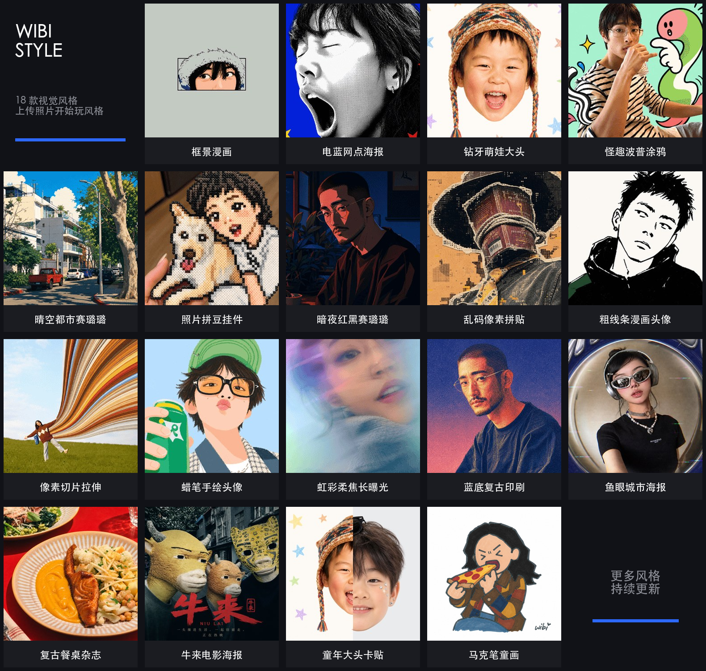

<div align="center">

<picture>
  <source media="(prefers-color-scheme: dark)" srcset="assets/brand-logo-dark.png">
  
</picture>

<h3>Turn everyday photos into art, with AI.</h3>

<p><sub>Pick a style, send a photo, get a finished image. No prompt writing, no parameter tuning.</sub></p>

<p>
<b>19</b> individually installable visual style Skills ·
<a href="https://style.abdc.online"><b>Try online</b></a> ·
<a href="#community">Community</a> ·
<a href="#use-and-attribution">License</a>
</p>

<p>
Made and maintained by <code>@威比 Hunter Wei.</code> — same handle on Douyin and Xiaohongshu<br>
<b>English</b> · <a href="README.md">简体中文</a>
</p>

</div>

---

> **For agents**: this is a set of ready-made visual style Skills — the user picks one, sends a photo, and what comes back is finished. Three things you need:
>
> - **What's here**: one table under [All styles](#all-styles), grouped by subject, with each style's name, call name, and the kind of photo it suits.
> - **How to install**: drop the call name into `https://github.com/Vieeeeeee/wibi-style/tree/main/skills/<call-name>` and have the user send that URL in Codex. Every style is its own directory — only the one they pick gets installed.
> - **How to use**: in a new task, send `Use $call-name on this photo`. Nothing else to run — the Skill introduces itself on first call.
>
> Everything else is your call, based on the user in front of you.

## Style overview

[](https://style.abdc.online)

> This is a single preview image; clicking it opens [Wibi Style Lab](https://style.abdc.online). To open one specific style, use the names in the table below.

## All styles

19 styles right now — find yours by the photo you have. Click a name for its detail page; the call name is both the last part of the install URL and the `$` command you use.

| Subject | Your photo | Styles (click the name for details · code is the call name) |
| --- | --- | --- |
| **Portraits & selfies** | Selfies, avatars, close-up people shots | <a href="skills/electric-blue-halftone-poster/"><b>Electric Blue Halftone Poster</b></a> <code>electric-blue-halftone-poster</code><br><sub>Single-person portraits or pet close-ups</sub><br><a href="skills/alt-manga-avatar/"><b>Bold Line Manga Avatar</b></a> <code>alt-manga-avatar</code><br><sub>Front-facing or three-quarter selfies</sub><br><a href="skills/art-print-poster/"><b>Crayon Sketch Avatar</b></a> <code>art-print-poster</code><br><sub>Selfies with clear features and a memorable expression</sub><br><a href="skills/dark-red-black-cel-shaded/"><b>Dark Red &amp; Black Cel Shade</b></a> <code>dark-red-black-cel-shaded</code><br><sub>Portraits that suit dramatic red-and-black lighting</sub><br><a href="skills/iridescent-long-exposure/"><b>Iridescent Long Exposure</b></a> <code>iridescent-long-exposure</code><br><sub>Close-ups where you want a hazy, dreamlike mood</sub><br><a href="skills/blue-retro-print/"><b>Blue Retro Print</b></a> <code>blue-retro-print</code><br><sub>Portraits with clear outlines and expression</sub><br><a href="skills/flash-triptych/"><b>Flash Triptych Model Card</b></a> <code>flash-triptych</code><br><sub>Single-person half-body or close-up photos for a cool direct-flash turn-card sequence</sub> |
| **Kids & childhood** | A child's face, or your own childhood look | <a href="skills/diamond-kid-head-card/"><b>Diamond Grin Kid Portrait</b></a> <code>diamond-kid-head-card</code><br><sub>Single-child photos where face, hair, or hat is recognizable</sub><br><a href="skills/kid-head-card/"><b>Childhood Head Card</b></a> <code>kid-head-card</code><br><sub>Old childhood photos; modern selfies are aged back to 5–8</sub> |
| **Group shots & posters** | Group photos, street shots, travel photos | <a href="skills/fisheye-city-cover/"><b>Fisheye City Poster</b></a> <code>fisheye-city-cover</code><br><sub>Into a Y2K heavy-fisheye city cover</sub><br><a href="skills/niulai-movie-poster/"><b>Niu Lai Movie Poster</b></a> <code>niulai-movie-poster</code><br><sub>Landscape solo, duo or trio photos into a low-budget old-animation cow-head Chinese film poster</sub> |
| **Anything goes** | People, pets, products, objects — all fine | <a href="skills/marker-child-doodle/"><b>Marker-Pen Child Doodle</b></a> <code>marker-child-doodle</code><br><sub>Real photos with clear people, pets, and props; half-body crops stay half-body</sub><br><a href="skills/quirky-pop-doodle-sticker/"><b>Quirky Pop Doodle Sticker</b></a> <code>quirky-pop-doodle-sticker</code><br><sub>Clear subject with a memorable pose — people, pets, products, props</sub><br><a href="skills/photo-perler-charm/"><b>Photo Perler Charm</b></a> <code>photo-perler-charm</code><br><sub>People, pets, bouquets, food, and objects with clean silhouettes</sub><br><a href="skills/pixel-stretch/"><b>Pixel Slice Stretch</b></a> <code>pixel-stretch</code><br><sub>People, still life, or anything with a clear subject</sub><br><a href="skills/glitch-pixel-collage/"><b>Glitch Pixel Collage</b></a> <code>glitch-pixel-collage</code><br><sub>People, still life, or photos with distinct color layers</sub> |
| **Scenes & food** | Streets, architecture, the dinner table | <a href="skills/clear-sky-urban-cel/"><b>Clear Sky Urban Cel</b></a> <code>clear-sky-urban-cel</code><br><sub>City streets, architecture, travel documentary, transit</sub><br><a href="skills/retro-table-print/"><b>Retro Table Magazine</b></a> <code>retro-table-print</code><br><sub>Table photos where dishes and vessels are readable</sub> |
| **Advanced · multi-step** | When you want to crop the best part first | <a href="skills/wibi-frame/"><b>Framed Comic Panel</b></a> <code>wibi-frame</code><br><sub>Photos with clear eye contact, expression, gesture, or object relationships — crop first, then generate</sub> |
<!-- style-catalog-end: the release script inserts new styles just above this line; move them into the right subject group afterwards. -->

> `Wibi Style ·` is a display prefix only. English Skill names, GitHub URLs, and `$call-names` never carry it.

## Install and use

### 1. Send the install command in Codex

Swap the call name in the URL for the style you picked (Electric Blue Halftone Poster shown here):

```text
Please install this Skill:
https://github.com/Vieeeeeee/wibi-style/tree/main/skills/electric-blue-halftone-poster
```

The installer downloads only that one Skill. Nothing else to do — the first time you call it, it introduces itself and tells you what's next.

### 2. Start a new task, upload a photo, and call it

```text
Use $electric-blue-halftone-poster on this photo
```

For any other style, swap `$electric-blue-halftone-poster` for its call name from the table above.

## Language note

The style logic inside each `SKILL.md` is written in Chinese, and the models read it fine — you can talk to the Skill in English and it will answer you in English. What is still Chinese-only today: the welcome card and author card the Skill prints on first use, and the per-style README inside each package. Everything works; some of the text just won't be in your language yet. English versions of those are planned.

## Community

<div align="center">

### 威比 😌 AIGC 学习群

A group for AI visual techniques, Skill usage questions, and new style previews


<p><sub>Valid until <b>August 26, 2026</b>. After that, add WeChat <code>Wibi2077</code> with the note 「进群」 for a new invite.</sub></p>

</div>

> Heads up: this is a **WeChat group and the conversation is in Chinese**. It needs the WeChat app, so it may not be practical outside mainland China. If you can't join, [open an issue](https://github.com/Vieeeeeee/wibi-style/issues) instead — that works from anywhere.

Skills that support the group entry read the root [`community.json`](community.json) on demand and reference the same QR code above. Once the group link, expiry date, and `assets/wechat-aigc-group-qr.jpg` are updated, already-installed Skills will pick up the new entry on their next lookup. This lookup uploads no photos and no usage data.

## What's included and how updates work

Every style ships its own `SKILL.md`, runtime rules, prompt, version manifest, and whatever reference material or support files that style needs. Nothing is shared or mixed between styles.

The first time you call a style in a new task, it checks whether that one style has a new version — nothing else. It only tells you when a newer version exists; it never overwrites your local files, and it uploads no photos and no usage data.

## Use and attribution

When you share generated results publicly, please credit:

```text
Visual Skill by @威比 Hunter Wei.
```

The original Skill logic, prompts, and original composition templates in this repository are for **personal, non-commercial use only** — please contact the author for permission before any commercial use. If you copy, modify, redistribute, mirror, or repackage a style, you must keep the author credit, the Douyin/Xiaohongshu handle note, the official source link, `LICENSE`, and `NOTICE`. Modified versions must be clearly marked as modified and must not present themselves as official.

Each Skill's `SOURCES.md` states exactly which rights the package does and does not hold. A third-party image being publicly visible does not grant redistribution rights; material that hasn't cleared the copyright gate never goes into a new public install package.
