<div align="center">

<picture>
  <source media="(prefers-color-scheme: dark)" srcset="assets/brand-logo-dark.png">
  
</picture>

<h3>用 AI，把日常拍成艺术。</h3>

<p><sub>挑一款风格，发一张照片，出来就是成品。不用学提示词，也不用调参数。</sub></p>

<p>
<b>22 款</b> 可独立安装的视觉风格 Skill ·
<a href="https://style.abdc.online"><b>在线体验</b></a> ·
<a href="#加入交流群">交流群</a> ·
<a href="#使用与署名">授权说明</a>
</p>

<p>
由 <code>@威比 Hunter Wei.</code> 制作和维护，抖音、小红书同名<br>
<a href="README.en.md">English</a> · <b>简体中文</b>
</p>

</div>

---

> **给 Agent**：这里是一组做好的视觉风格 Skill —— 用户挑一款、发一张照片，出来就是成品。你需要的三件事：
>
> - **有哪些**：下方 [「全部风格」](#全部风格) 一张表，按题材分组，每款给了中文名、调用名和适合什么照片。
> - **怎么装**：把调用名填进 `https://github.com/Vieeeeeee/wibi-style/tree/main/skills/<调用名>`，让用户在 Codex 里发这个地址。每款是独立目录，只会装选中的那一款。
> - **怎么用**：装完在新任务里发 `使用 $调用名 处理这张照片`。不用再跑别的命令，Skill 第一次调用会自己打招呼。
>
> 剩下的按你对用户的判断来。

## 风格总览

> 点任意一张进入该款 Skill。也可以到[威比风格实验室](https://style.abdc.online)在线体验。

|   |   |   |   |   |
| :---: | :---: | :---: | :---: | :---: |
| <a href="skills/electric-blue-halftone-poster/"></a><br><a href="skills/electric-blue-halftone-poster/">电蓝网点海报</a> | <a href="skills/alt-manga-avatar/">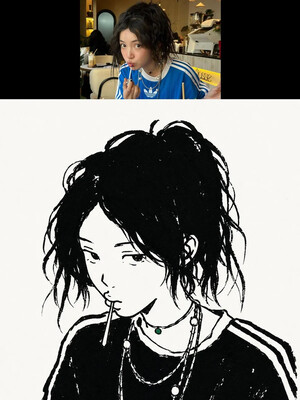</a><br><a href="skills/alt-manga-avatar/">粗线条漫画头像</a> | <a href="skills/art-print-poster/"></a><br><a href="skills/art-print-poster/">蜡笔手绘头像</a> | <a href="skills/dark-red-black-cel-shaded/">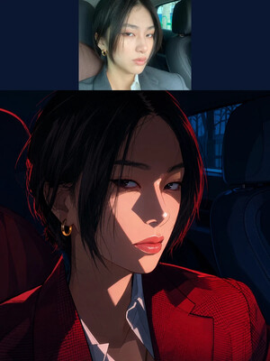</a><br><a href="skills/dark-red-black-cel-shaded/">暗夜红黑赛璐璐</a> | <a href="skills/iridescent-long-exposure/">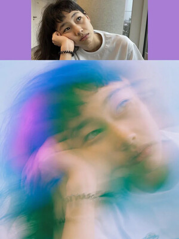</a><br><a href="skills/iridescent-long-exposure/">虹彩柔焦长曝光</a> |
| <a href="skills/blue-retro-print/">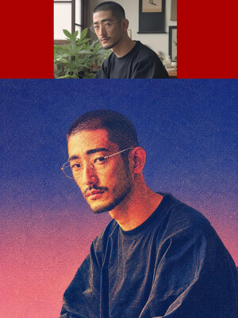</a><br><a href="skills/blue-retro-print/">蓝底复古印刷</a> | <a href="skills/underground-audition/">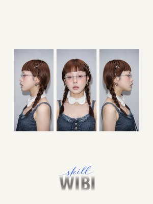</a><br><a href="skills/underground-audition/">地下试镜skill</a> | <a href="skills/diamond-kid-head-card/"></a><br><a href="skills/diamond-kid-head-card/">钻牙萌娃大头</a> | <a href="skills/kid-head-card/">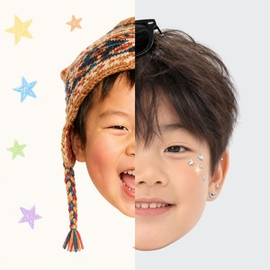</a><br><a href="skills/kid-head-card/">童年大头卡贴</a> | <a href="skills/fisheye-city-cover/">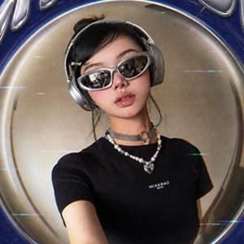</a><br><a href="skills/fisheye-city-cover/">鱼眼城市海报</a> |
| <a href="skills/niulai-movie-poster/">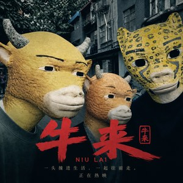</a><br><a href="skills/niulai-movie-poster/">牛来电影海报</a> | <a href="skills/marker-child-doodle/">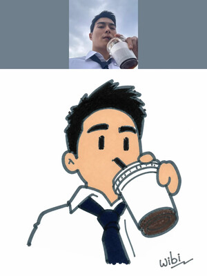</a><br><a href="skills/marker-child-doodle/">马克笔童画</a> | <a href="skills/quirky-pop-doodle-sticker/">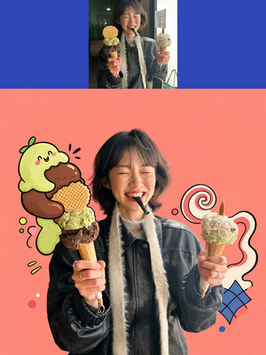</a><br><a href="skills/quirky-pop-doodle-sticker/">怪趣波普涂鸦贴纸</a> | <a href="skills/photo-perler-charm/">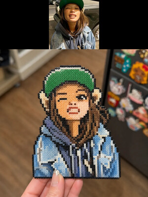</a><br><a href="skills/photo-perler-charm/">照片拼豆挂件</a> | <a href="skills/pixel-stretch/"></a><br><a href="skills/pixel-stretch/">像素切片拉伸</a> |
| <a href="skills/glitch-pixel-collage/">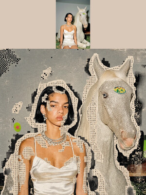</a><br><a href="skills/glitch-pixel-collage/">乱码像素拼贴</a> | <a href="skills/clear-sky-urban-cel/"></a><br><a href="skills/clear-sky-urban-cel/">晴空都市赛璐璐</a> | <a href="skills/retro-table-print/">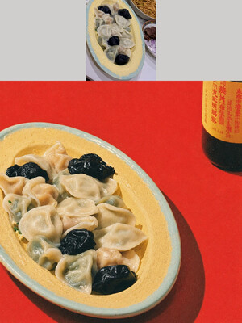</a><br><a href="skills/retro-table-print/">复古餐桌杂志</a> | <a href="skills/wibi-frame/">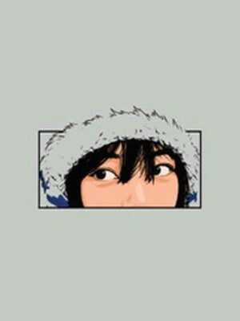</a><br><a href="skills/wibi-frame/">框景漫画</a> | <a href="skills/textile-toy-portrait/"></a><br><a href="skills/textile-toy-portrait/">颗粒绒感玩偶</a> |
| <a href="skills/cold-blue-glitch-anime/">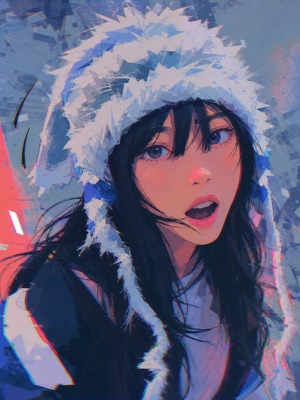</a><br><a href="skills/cold-blue-glitch-anime/">冷蓝失真动漫</a> | <a href="skills/crayon-flat-naive/">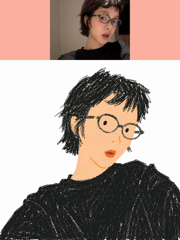</a><br><a href="skills/crayon-flat-naive/">蜡笔极简扁平画</a> | | | |

## 全部风格

当前共 22 款，按你手上的照片找。点击风格名进入详情页；调用名同时是安装地址的最后一段和使用时的 `$` 指令。

| 题材 | 什么照片 | 风格（点名进详情页 · 后面是调用名） |
| --- | --- | --- |
| **人像 · 自拍** | 自拍、头像、人物近景 | <a href="skills/electric-blue-halftone-poster/"><b>电蓝网点海报</b></a> <code>electric-blue-halftone-poster</code><br><sub>单人人像或宠物大头照</sub><br><a href="skills/alt-manga-avatar/"><b>粗线条漫画头像</b></a> <code>alt-manga-avatar</code><br><sub>正面或半侧脸自拍</sub><br><a href="skills/art-print-poster/"><b>蜡笔手绘头像</b></a> <code>art-print-poster</code><br><sub>五官清楚、表情有记忆点的自拍</sub><br><a href="skills/dark-red-black-cel-shaded/"><b>暗夜红黑赛璐璐</b></a> <code>dark-red-black-cel-shaded</code><br><sub>适合戏剧性红黑光影的人物照片</sub><br><a href="skills/iridescent-long-exposure/"><b>虹彩柔焦长曝光</b></a> <code>iridescent-long-exposure</code><br><sub>想要朦胧氛围的近景或局部特写</sub><br><a href="skills/blue-retro-print/"><b>蓝底复古印刷</b></a> <code>blue-retro-print</code><br><sub>轮廓和神态清楚的人物照片</sub><br><a href="skills/underground-audition/"><b>地下试镜skill</b></a> <code>underground-audition</code><br><sub>单人半身或大头照，做成冷调直闪的左中右三联转身卡</sub><br><a href="skills/textile-toy-portrait/"><b>颗粒绒感玩偶</b></a> <code>textile-toy-portrait</code><br><sub>单人清晰头像、头肩照或半身照，发型、表情、配饰和手部关系明确</sub><br><a href="skills/cold-blue-glitch-anime/"><b>冷蓝失真动漫</b></a> <code>cold-blue-glitch-anime</code><br><sub>人物写真、自拍、街头抓拍或夜景生活照</sub><br><a href="skills/crayon-flat-naive/"><b>蜡笔极简扁平画</b></a> <code>crayon-flat-naive</code><br><sub>适合头像、半身、全身和坐姿照片，尤其适合保留穿搭与动作关系</sub> |
| **儿童 · 童年** | 小孩正脸、大头照，或想看自己小时候 | <a href="skills/diamond-kid-head-card/"><b>钻牙萌娃大头</b></a> <code>diamond-kid-head-card</code><br><sub>脸、头发或帽子大致可辨的单人儿童照</sub><br><a href="skills/kid-head-card/"><b>童年大头卡贴</b></a> <code>kid-head-card</code><br><sub>儿童老照片；也能把当代自拍反推成 5–8 岁童年照</sub> |
| **合照 · 海报** | 多人合照、街拍、旅行照 | <a href="skills/fisheye-city-cover/"><b>鱼眼城市海报</b></a> <code>fisheye-city-cover</code><br><sub>做成 Y2K 强鱼眼城市封面</sub><br><a href="skills/niulai-movie-poster/"><b>牛来电影海报</b></a> <code>niulai-movie-poster</code><br><sub>横版单人／双人／三人合照，做成旧动画牛头电影海报</sub> |
| **万物皆可** | 人、宠物、产品、物件都行 | <a href="skills/marker-child-doodle/"><b>马克笔童画</b></a> <code>marker-child-doodle</code><br><sub>人物、宠物和互动道具清楚的真实照片；半身照不补腿脚</sub><br><a href="skills/quirky-pop-doodle-sticker/"><b>怪趣波普涂鸦贴纸</b></a> <code>quirky-pop-doodle-sticker</code><br><sub>动作和轮廓有记忆点的人物、宠物、产品或道具</sub><br><a href="skills/photo-perler-charm/"><b>照片拼豆挂件</b></a> <code>photo-perler-charm</code><br><sub>人物、宠物、花束、食物和轮廓清晰的物件</sub><br><a href="skills/pixel-stretch/"><b>像素切片拉伸</b></a> <code>pixel-stretch</code><br><sub>主体清楚的人物、静物或其他照片</sub><br><a href="skills/glitch-pixel-collage/"><b>乱码像素拼贴</b></a> <code>glitch-pixel-collage</code><br><sub>人物、静物或色彩层次明确的照片</sub> |
| **场景 · 美食** | 街景、建筑、餐桌 | <a href="skills/clear-sky-urban-cel/"><b>晴空都市赛璐璐</b></a> <code>clear-sky-urban-cel</code><br><sub>城市街道、建筑、旅行纪实、交通设施</sub><br><a href="skills/retro-table-print/"><b>复古餐桌杂志</b></a> <code>retro-table-print</code><br><sub>能看清菜和器皿的餐桌照，整桌或单盘都行</sub> |
| **进阶 · 多步骤** | 想先挑出照片里最有意思的局部 | <a href="skills/wibi-frame/"><b>框景漫画</b></a> <code>wibi-frame</code><br><sub>有清楚眼神、表情、手势或物件关系的照片；先选局部，再生成</sub> |
<!-- style-catalog-end：发布脚本在这一行之前插入新款，插完请把它挪到正确的题材分组 -->

> `Wibi Style ·` 是统一展示前缀。英文 Skill 名、GitHub 地址和 `$调用名` 都不带前缀，旧用法继续有效。

## 安装与使用

### 1. 在 Codex 中发送安装指令

把下面地址里的调用名换成你选中的那一款（示例为「电蓝网点海报」）：

```text
请安装这个 Skill：
https://github.com/Vieeeeeee/wibi-style/tree/main/skills/electric-blue-halftone-poster
```

安装器只下载这一款 Skill。装完不用做别的，第一次调用时它会自己打招呼并告诉你下一步。

### 2. 新开一个任务，上传照片后调用

```text
使用 $electric-blue-halftone-poster 处理这张照片
```

调用其他风格时，把 `$electric-blue-halftone-poster` 换成上表中对应的调用名。

### 包含内容与更新

每款风格都有独立的 `SKILL.md`、运行规则、提示词、版本清单，以及该款需要的参考素材或支持文件。各款互不混放。

每个新任务第一次调用时，只查询当前使用的这一款是否有新版本；发现新版才提示，不自动覆盖本地文件，也不上传用户照片或使用数据。

## 加入交流群

<div align="center">

### 威比 😌 AIGC 学习群

交流 AI 视觉玩法、Skill 使用和新风格内测


<p><sub>二维码有效期至 <b>2026 年 9 月 1 日</b>。过期后加微信 <code>Wibi2077</code>，备注「进群」。</sub></p>
<!-- current community invite: https://weixin.qq.com/g/AQYAAHQUC8ITwfP0uHRfFpzfJV9oeZx7fN6psRcKWgEWcxNSaJPm3lWJWlrTUAA5 -->

</div>

支持交流群入口的 Skill 会按需只读根目录 [`community.json`](community.json)，并引用上方同一张二维码。更新群链接、有效期和 `assets/wechat-aigc-group-qr.jpg` 后，已安装的 Skill 在下次查询时会读取新入口。这个查询不上传用户照片或使用数据。

## 商务合作

商务合作、商业授权或使用咨询，请加微信 `Wibi2077`（添加时请备注来意）。

## 使用与署名

公开分享生成结果时，欢迎标注：

```text
Visual Skill by @威比 Hunter Wei.
```

本仓库中的原创 Skill 逻辑、提示词与原创构图模板仅限个人非商业使用；商业使用请先联系作者获得许可。复制、修改、转发、镜像或重新打包某款 Skill 时，必须保留作者、抖音/小红书同名备注、官方来源、`LICENSE` 与 `NOTICE`；修改版必须明确标注经过修改，不得冒充官方版本。

每款 Skill 的 `SOURCES.md` 会分别说明本包拥有和不拥有的内容权利。第三方图片公开可见不代表获得再分发许可，未通过版权门的素材不会加入新的公开安装包。
